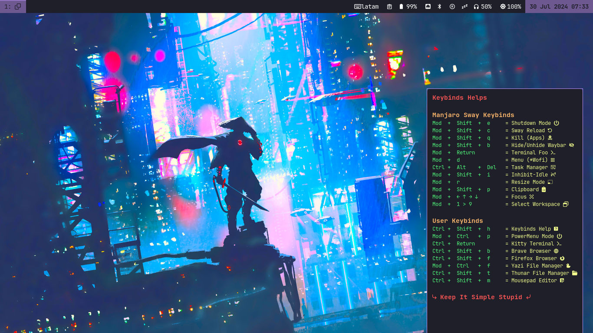

# DOTFILES
Mi configuración y personalización realizadas sobre la instalación de Manjaro Sway. Mi tema de color es utilizando [**Dracula Theme**](https://draculatheme.com/).

## Fondo de pantalla y Waybar
Muestra del fondo de pantalla y de la disposicion de elementos en la [**Waybar**](waybar/.config/waybar/config.jsonc)

## Powermenu
Modo para las opciones del menu salida de **Sway**, basado en el Modo Shutdown que viene en el Manjaro. [**Powermenu**](sway/.config/sway/modes.d/powermenu)

## Keybinds help 
Menú o guía rápida de los atajos de teclado configurados en el Sway, por medio del script [**KeybindsHelp**](sway/.config/sway/scripts.d/KeybindsHelp.sh). 
Se requiere instalar [**Yad**](https://yad-guide.ingk.se/) para visualizar la ventana. 

