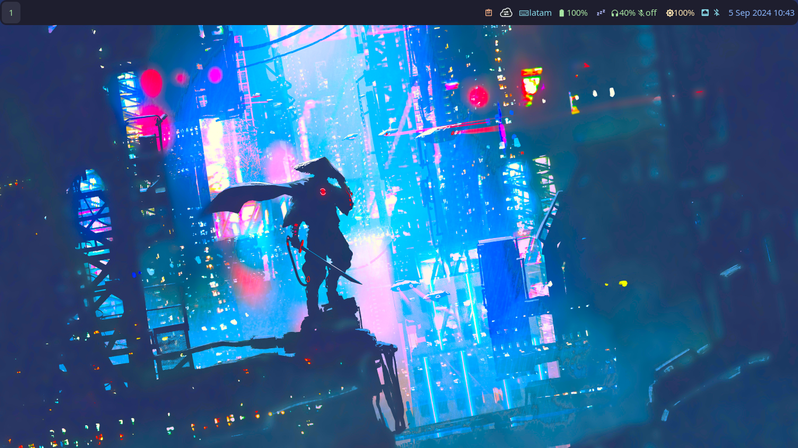

# DOTFILES
Mi configuración y personalización realizadas sobre la instalación de Manjaro Sway. Mi tema de color es utilizando [**Dracula Theme**](https://draculatheme.com/).

## Fondo de pantalla y Waybar
Muestra del fondo de pantalla y de la disposicion de elementos en la [waybar](waybar/.config/waybar/config.jsonc)
### Actualizado Sept/2024
**Waybar:** Agregado archivos [style.css](waybar/.config/waybar/style.css) (para el estilo) y [mocha.css](waybar/.config/waybar/mocha.css) (tema de color)

## Powermenu
El **Modo Powermenu** llama un menu de opciones para la salida de *Sway*; es basado en el **Modo Shutdown** que viene incluido en *Manjaro*. [powermenu](sway/.config/sway/modes.d/powermenu) 

## Keybinds help 
Menú o guía rápida de los atajos de teclado configurados en el Sway, por medio del script [keybindshelp](sway/.config/sway/scripts.d/KeybindsHelp.sh). 
Se requiere instalar [**Yad**](https://yad-guide.ingk.se/) para visualizar la ventana. 

